# Rshell - 跨平台多协议C2框架

Rshell是一款开源的golang编写的支持多平台的C2框架，旨在帮助安服人员渗透测试、红蓝对抗。功能介绍如下：

## 基础使用

下载Rshell二进制文件并运行。

通过-p参数指定端口（默认端口8089）并运行：

```
./Rshell -p 8089
```

**默认账号密码：admin/admin123**


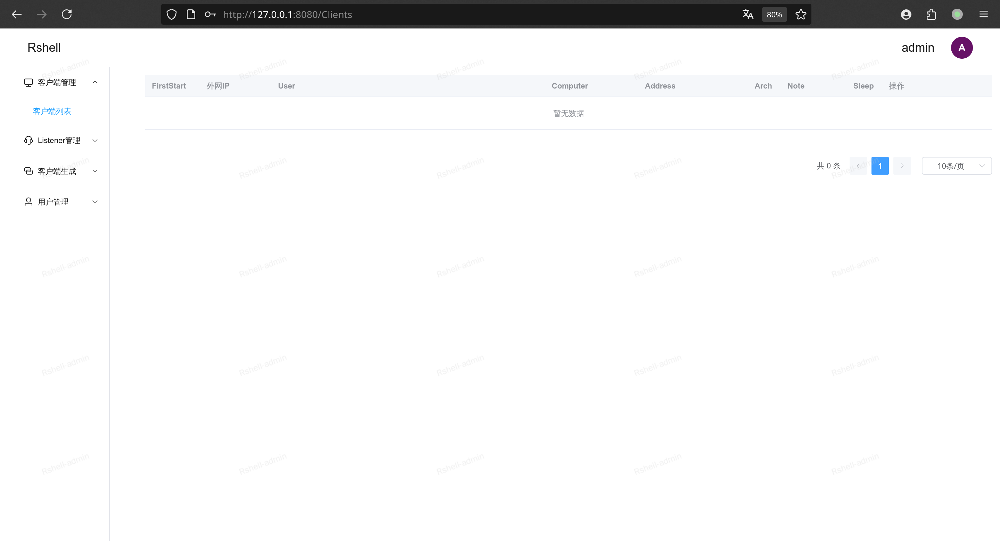

## 添加listener

目前支持websocket、tcp、kcp、http、oss协议监听：

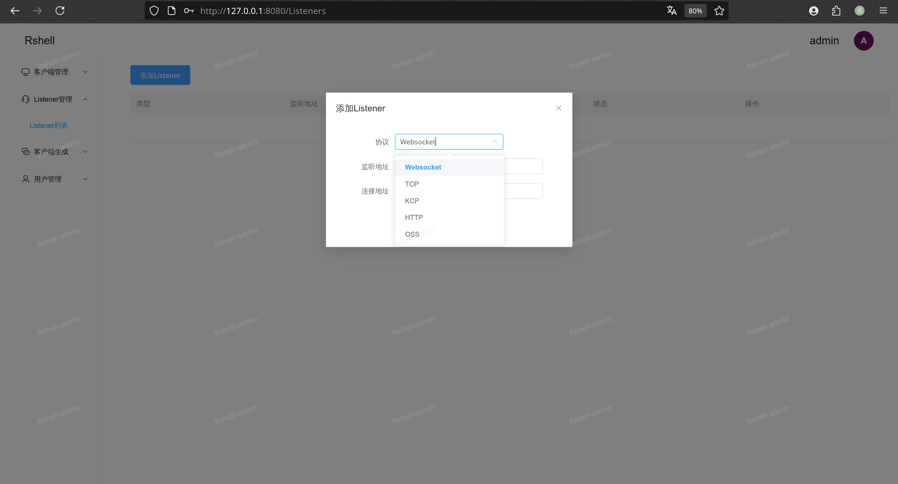

## 生成客户端

支持windows、linux（darwin未充分测试）

**注：客户端需要加上反沙箱默认密码上线  如： r.exe tNROopcR45q4Z8I1**

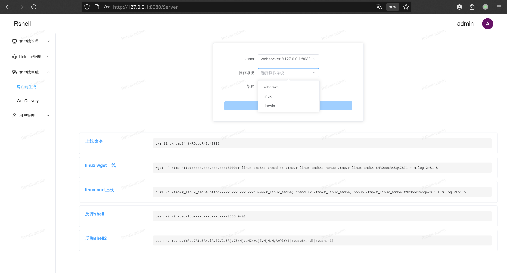

## Webdelivery

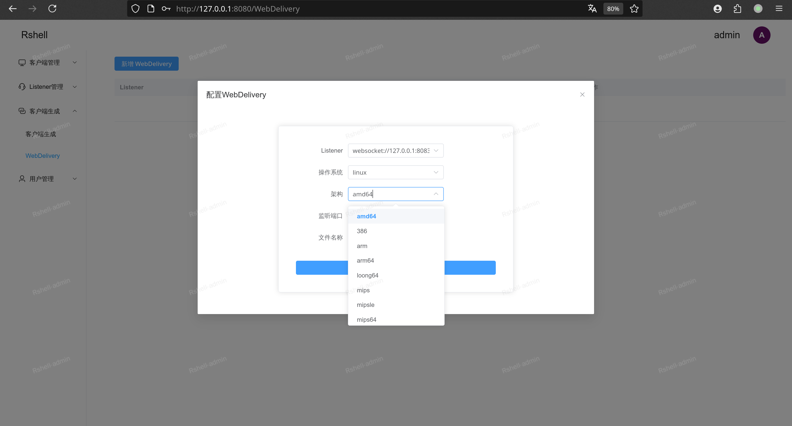

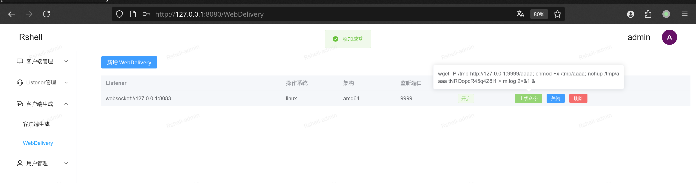

## 客户端管理

### 支持Note、颜色标记

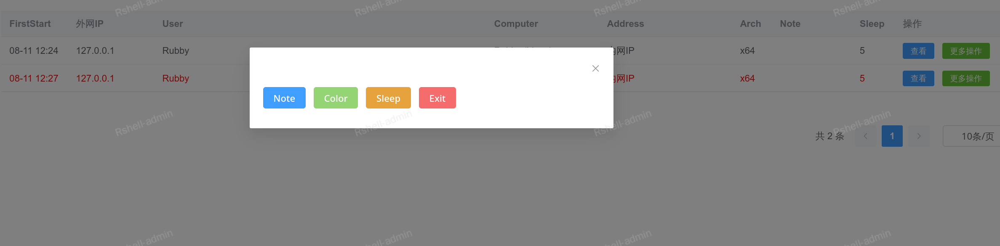

### 命令执行

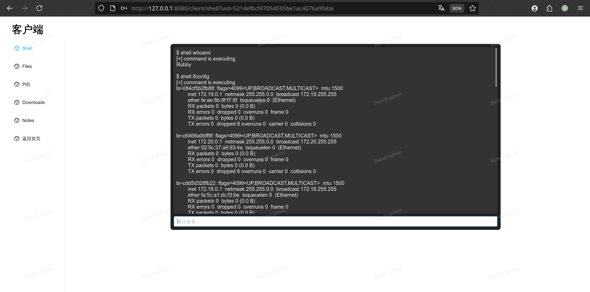

### 文件管理

双击进入文件夹：

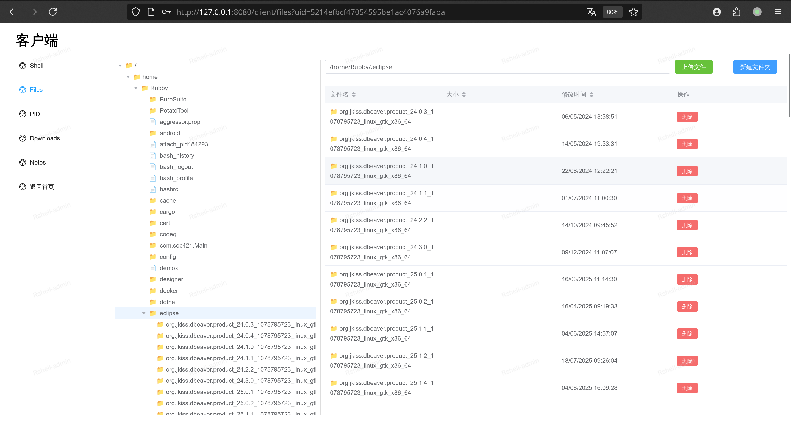

双击预览文本文件：

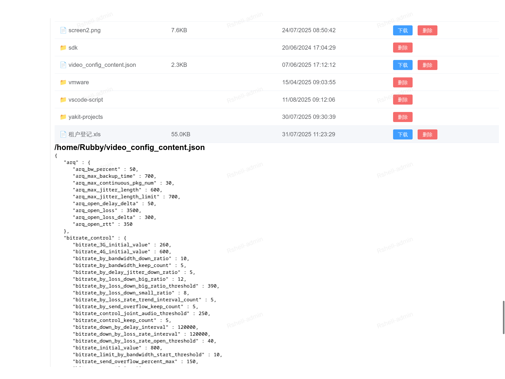

### PID查看

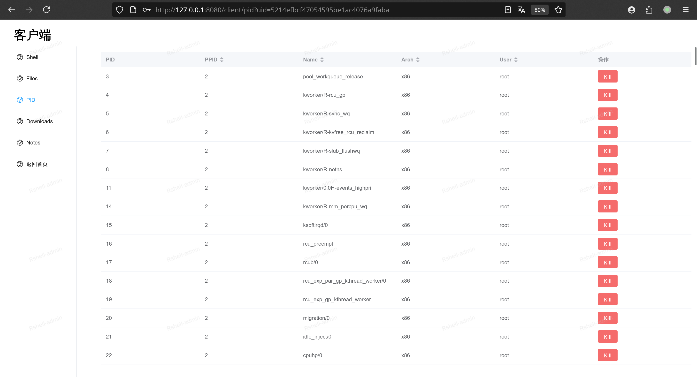

### 文件下载

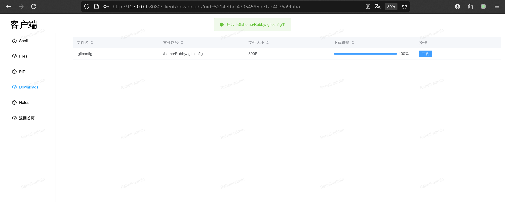

### 笔记

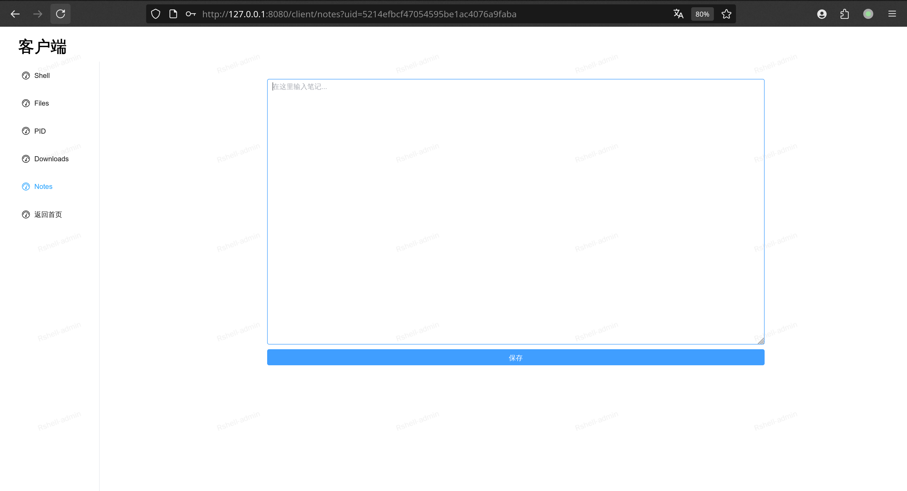

# 相关项目

客户端开源地址：https://github.com/Rubby2001/Rshell-client

# 免责声明

1. 本项目（[项目名称]）仅为网络安全研究、合法授权测试及教育目的而设计开发，旨在帮助安全专业人员提升防御能力、测试系统安全性。
2. **禁止将本项目用于任何非法用途**，包括但不限于：
   - 未经授权的系统入侵
   - 网络攻击活动
   - 任何违反《中华人民共和国网络安全法》《刑法》等法律法规的行为
3. 使用者应确保在**完全合法授权**的前提下使用本工具，开发者不对任何滥用行为负责。
4. 本工具提供的功能可能对目标系统造成影响，使用者需自行承担所有风险，确保：
   - 已获得目标系统的明确授权
   - 遵守当地法律法规
   - 不会危害关键信息基础设施
5. 开发者不承诺工具的隐蔽性、稳定性或适用性，不承担因使用本工具导致的任何直接或间接责任。
6. 下载、使用本项目即表示您已充分阅读并同意本声明所有条款。
